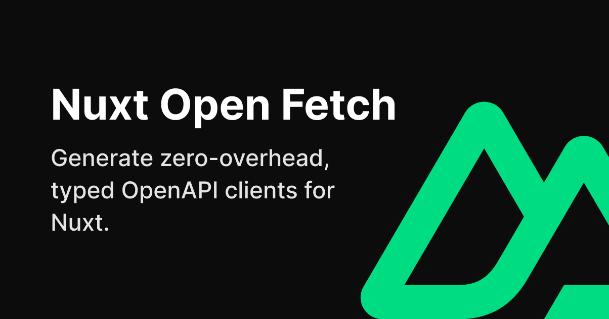

<!--
Get your module up and running quickly.

Find and replace all on all files (CMD+SHIFT+F):
- Name: My Module
- Package name: my-module
- Description: My new Nuxt module
-->
[](https://nuxt-open-fetch.vercel.app/)

# Nuxt Open Fetch X

[![npm version][npm-version-src]][npm-version-href]
[![License][license-src]][license-href]
[![Nuxt][nuxt-src]][nuxt-href]

> [!IMPORTANT]
> This repository is a fork of the original, now unmaintained [nuxt-open-fetch](https://github.com/enkot/nuxt-open-fetch) by [enkot](https://github.com/enkot).\
> While it doesn't add many new features, it includes numerous bug fixes, Nuxt 4 support, and other improvements.

Generate zero-overhead, 100% typed OpenAPI clients for Nuxt.

In other words - `$fetch` and `useFetch` on steroids. Uses awesome [openapi-typescript](https://github.com/drwpow/openapi-typescript) generator under the hood.

> ⚠️ APIs are subject to change.
> All ideas/suggestions are welcome! :)

- [✨ &nbsp;Release Notes](/CHANGELOG.md)
- [📖 &nbsp;Read the documentation](https://nuxt-open-fetch.vercel.app/)
<!-- - [🏀 Online playground](https://stackblitz.com/github/your-org/my-module?file=playground%2Fapp.vue) -->
<!-- - [📖 &nbsp;Documentation](https://example.com) -->

## Features

<!-- Highlight some of the features your module provide here -->
- 🍹 &nbsp;No manual typing of your API
- 🍋 &nbsp;Supports OpenAPI 3.0 and 3.1 (including advanced features like [discriminators](https://spec.openapis.org/oas/v3.1.0#discriminator-object))
- 🌲 &nbsp;Uses runtime-free types that outperform old-school codegen
- 📡 &nbsp;Load schemas from YAML or JSON, locally or remotely
- 🥞 &nbsp;Works with Nuxt [Layers](https://nuxt.com/docs/getting-started/layers)

## Quick Setup

1. Add `nuxt-open-fetch-x` dependency to your project

```bash
# Using pnpm
pnpm add -D nuxt-open-fetch-x

# Using yarn
yarn add --dev nuxt-open-fetch-x

# Using npm
npm install --save-dev nuxt-open-fetch-x
```

2. Add `nuxt-open-fetch-x` to the `modules` section of `nuxt.config.ts`

```js
export default defineNuxtConfig({
  modules: [
    'nuxt-open-fetch-x'
  ]
})
```

That's it! You can now use `nuxt-open-fetch-x` in your Nuxt app ✨

## Migrate from `nuxt-open-fetch`

To migrate from `nuxt-open-fetch`, simply replace all instances of `nuxt-open-fetch` with `nuxt-open-fetch-x` in your `package.json` and `nuxt.config.ts.`

## Development

```bash
# Install dependencies
pnpm install

# Generate type stubs
pnpm dev:prepare

# Develop with the playground
pnpm dev

# Build the playground
pnpm dev:build

# Run ESLint
pnpm lint

# Run Vitest
pnpm test
pnpm test:watch

# Release new version
pnpm release
```

## License

Made with 💚

Published under the [MIT License](./LICENCE).

<!-- Badges -->
[npm-version-src]: https://img.shields.io/npm/v/nuxt-open-fetch-x/latest.svg?style=flat&colorA=18181B&colorB=28CF8D
[npm-version-href]: https://npmjs.com/package/nuxt-open-fetch-x

[license-src]: https://img.shields.io/npm/l/nuxt-open-fetch-x.svg?style=flat&colorA=18181B&colorB=28CF8D
[license-href]: https://npmjs.com/package/nuxt-open-fetch-x

[nuxt-src]: https://img.shields.io/badge/Nuxt-18181B?logo=nuxt.js
[nuxt-href]: https://nuxt.com
